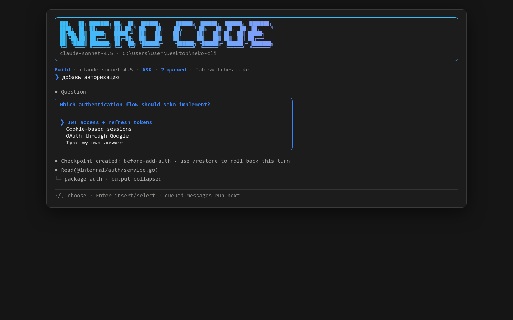

# Neko

Neko is a Go terminal coding agent with a Claude Code-style interface, Build/Plan modes, reviewable file edits, safe command execution, resumable project sessions, skills, `AGENTS.md`, OpenAI-compatible APIs, and Anthropic.

> Version 0.4.2. Neko adds a third mode — Reverse — with 26 reverse-engineering skills that register themselves, replays conversation history when resuming a session, and runs up to 25 detached background agents with `/bg`.



## Core behavior

- **Build / Plan / Reverse:** press `Tab` at an empty prompt to cycle, or use `/build`, `/plan`, and `/reverse`. Build is blue, Plan orange, Reverse purple.
- **Reverse mode:** for artifacts you did not write — binaries, bytecode, obfuscated code, undocumented protocols. 26 skills register themselves the first time you enter the mode; no setup needed.
- **Ask by default:** writes, shell commands, and skill registration offer `Allow once`, `Allow for session`, or `Deny`.
- **YOLO:** `--yolo` auto-approves allowed actions. Hard-blocked machine-wide destructive commands remain blocked.
- **Project context:** Neko discovers the Git root, sends a bounded project tree, and loads global/root/nested `AGENTS.md` instructions.
- **Tools:** read, list, search, targeted replace, full write, shell, tests, Git diff, plans, and skills.
- **Verification loop:** the system prompt requires reading first, using tools, checking changed files, and running suitable tests.
- **Sessions:** each project has isolated UUID sessions with messages, plans, usage, summaries, and undo history.
- **Background agents:** `/bg <task>` detaches an agent into its own session; up to 25 run at once and report back when they finish.
- **Providers:** OpenAI Chat Completions-compatible streaming and Anthropic Messages streaming.
- **Model import:** models come from `<base-url>/models` and refresh after three hours.
- **Context control:** auto-compaction at 90% by default; `/autocompact` toggles it.
- **Claude Code-style UI:** one persistent full-screen session with a compact welcome card, scrollable conversation, persistent status line, `❯` input, slash-command hints, tool activity, thinking state, and boxed permission modals.
- **Visible user turns:** submitted prompts stay in the conversation as `❯ user message`, alongside assistant and tool output.
- **Clarification questions:** the model can present exactly three choices plus `Type my own answer…`.
- **Queued steering:** prompts entered while the agent works remain visible, run as the next user turn, and appear as a mode-colored queue count.
- **Fleet status:** the status line shows `N/25 bg` while background agents run.
- **Searchable input:** `/` searches commands and `@` searches project files; arrows choose and Enter inserts.
- **Checkpoints:** every user task creates a restore point; `/checkpoint`, `/checkpoints`, and `/restore` manage rollbacks.
- **Compact tools:** tool results appear as one-line collapsed summaries.
- **Cross-platform input:** Bubble Tea handles Tab, arrows, Unicode, resizing, and Windows terminals.
- **English UI:** prompts, permissions, commands, and errors are in English.

## Install

Requires Go 1.22 or newer.

```bash
git clone <repository-url> neko-cli
cd neko-cli
go test ./...
go install .
```

Or build locally:

```bash
go build -o bin/neko .
./bin/neko
```

The first build downloads the Charm terminal UI libraries declared in `go.mod`. The resulting executable is a standalone binary.

## First run

Neko opens a provider wizard:

1. Select `OpenAI-compatible` or `Anthropic` with arrow keys.
2. Enter a provider name.
3. Enter a base URL that already includes `/v1` when required.
4. Choose authentication: paste an API key or provide an environment-variable name. Pasted keys are masked during entry and saved only in the owner-readable local config.
5. Neko imports models from `/models`; select one with arrow keys.

Examples:

```bash
export OPENAI_API_KEY='...'
neko

export ANTHROPIC_API_KEY='...'
neko
```

Default base URLs:

```text
OpenAI:   https://api.openai.com/v1
Anthropic: https://api.anthropic.com/v1
```

For an OpenAI-compatible gateway, use the gateway's full HTTPS `/v1` base URL. You can paste its key directly or reference an environment variable.

## Sessions

```bash
neko --continue
neko --resume 550e8400-e29b-41d4-a716-446655440000
neko --continue --yolo
```

- `--continue` opens the most recently updated session for the current project.
- `--resume <id>` opens a specific session in the current project.
- Both replay the stored transcript into the conversation, so you see the history instead of an empty screen. The active mode is restored too.
- New sessions are created when neither flag is present.
- `/session` prints the active ID; `/sessions` lists project sessions.
- Background agents create their own sessions, so they appear in `/sessions` and can be resumed with `--resume`.

## Modes

| Mode | Accent | Tools | Purpose |
|---|---|---|---|
| Build | Blue | All | Write and change code, run commands, verify. |
| Plan | Orange | Read-only | Investigate and produce an implementation plan. |
| Reverse | Purple | All | Understand artifacts you did not write. |

`Tab` at an empty prompt cycles Build → Plan → Reverse. The active mode is stored in the session and restored on `--continue`.

Reverse mode changes the system prompt rather than the permissions: it tells the agent to work outside-in (identify format and toolchain, map entry points and strings, then read individual functions), to write findings down as notes or annotated pseudocode, and to state explicitly what it verified versus inferred. It keeps full tool access because recovery work means writing notes, scripts, and reimplementations — not just reading.

Entering Reverse mode for the first time registers its 26 bundled skills automatically.

## Background agents

`/bg <task>` starts an agent that runs detached from the conversation. The foreground prompt stays free, so you can keep working or start more tasks.

```text
❯ /bg add tests for internal/diff
✓ Background bg-1 started (1/25): add tests for internal/diff
● Session 7c1f… · /bgs lists agents · /bglog bg-1 shows output

❯ /bgs
Background agents: 2 running of 25 allowed
- bg-1  running    12s  add tests for internal/diff
- bg-2  done        4s  update the changelog
```

Each background agent gets its own session, its own tool registry, and its own permission policy. Nothing it does touches the foreground transcript, and the fleet is capped at 25 concurrent agents. `--background-jobs <n>` lowers the cap for one run:

```bash
neko --background-jobs 5
```

Completion, failure, and cancellation are reported in the conversation as they happen. `/bglog <id>` prints the captured transcript, bounded to the most recent 500 lines.

Detached agents cannot prompt you, which has two consequences:

- `ask_user` always fails. The system prompt tells the agent to finish autonomously and report what it could not resolve.
- In Ask mode every write and command is denied, because there is nobody to approve it. Background agents are useful for read-only investigation in Ask mode; pair `/bg` with `--yolo` when you want them to change files.

Cancellation is cooperative: `/bgstop <id>` cancels the agent's context, so it stops at the next tool or model boundary rather than mid-write. Exiting Neko cancels every running agent and waits up to five seconds for them to unwind.

## Permission model

### Ask mode (default)

Neko asks before writes, commands, or adding skills:

```text
Permission required
Run project tests
$ go test ./...

› Allow once
  Allow for session
  Deny
```

### YOLO mode

```bash
neko --yolo
```

YOLO permits file writes, `.env` changes, commands, `git push`, and skill registration without prompting. It does **not** bypass hard safety blocks.

Always blocked:

- `sudo`
- `rm -rf /`, equivalent root deletion, and `--no-preserve-root`
- `mkfs`
- `shutdown`, `reboot`, and `poweroff`
- shell fork bombs
- tool file access outside the project root

YOLO is intentionally powerful. Run it only in a disposable container, VM, or repository with a clean Git state.

## Commands

| Command | Action |
|---|---|
| `/build` | Switch to Build mode |
| `/plan` | Switch to Plan mode |
| `/reverse` | Switch to Reverse mode |
| `/mode` | Cycle Build → Plan → Reverse |
| `/addprovider` | Add or replace a provider (`/addprovide` alias supported) |
| `/providers` | Select a provider |
| `/model` | Select an imported model |
| `/compact` | Compact context now |
| `/autocompact` | Enable or disable compaction at 90% |
| `/context` | Show estimated context usage |
| `/cost` | Show token usage and configured cost estimate |
| `/diff` | Show current Git diff |
| `/undo` | Undo the latest Neko file write |
| `/bg <task>` | Start a detached background agent (up to 25 at once) |
| `/bgs` | List background agents, status, and elapsed time (`/jobs` alias) |
| `/bglog <id>` | Show the captured output of one background agent |
| `/bgstop <id\|all>` | Cancel one background agent or every running one |
| `/skills` | List skills and which mode each applies to |
| `/addskill` | Add a local skill directory |
| `/addskills [dir]` | Reinstall bundled skills for this mode, or add your own from a directory |
| `/permissions` | Explain current permission mode |
| `/session` | Show active session ID |
| `/sessions` | List project sessions |
| `/exit` | Exit |

## `AGENTS.md`

Neko loads instructions in this order:

1. `~/.config/neko/AGENTS.md` (platform config directory)
2. `<git-root>/AGENTS.md`
3. Nested `AGENTS.md` files from the root to the current directory

Example:

```md
# Project instructions

- Use PostgreSQL.
- Do not change public APIs without asking.
- Run `go test ./...` after edits.
- Add tests for new behavior.
```

Instructions become part of every model turn, including resumed sessions.

## Skills

A skill is a local directory containing `SKILL.md`.

```text
my-skill/
└── SKILL.md
```

Optional YAML frontmatter tags a skill with a mode and a one-line summary:

```md
---
name: binary-triage
mode: reverse
summary: First-pass identification of an unknown binary.
---
```

A skill with `mode:` is offered only in that mode. Without it, the skill applies everywhere. Summaries appear in the system prompt so the model knows what is available before loading anything.

Register one skill, or a whole directory of them:

```text
/addskill review-security ./skills/review-security
/addskills ./skills/reverse
```

The user must approve registration in Ask mode — `/addskills` asks once for the whole set and previews the names. The agent then calls `load_skill` when a task matches.

### Reverse mode skills

Switching to Reverse mode registers 26 skills the first time. They are embedded in the binary and unpacked into the config directory — nothing is written into your project, and no manual step is needed.

| Area | Skills |
|---|---|
| Orientation | `binary-triage` · `notes-and-reporting` |
| Native code | `ghidra-workflow` · `cpp-structure-recovery` · `crypto-identification` |
| Protection | `anti-reversing` · `dynamic-instrumentation` · `symbolic-execution` |
| Languages | `golang-binaries` · `rust-binaries` · `dotnet-assemblies` · `jvm-bytecode` · `python-bytecode` · `luajit-bytecode` |
| Web & apps | `js-deobfuscation` · `wasm-analysis` · `electron-apps` · `api-reverse-engineering` |
| Mobile & games | `android-apk` · `unity-il2cpp` |
| Embedded | `firmware-analysis` |
| Formats | `protocol-analysis` · `file-format-analysis` |
| Applied | `malware-static` · `ctf-reversing` · `legacy-code-archaeology` |

`binary-triage` is the entry point — it identifies an unknown artifact and names the skill that applies. Each skill describes method rather than specific tool invocations, so they stay accurate as tooling changes.

`/addskills` reinstalls them if you deleted one. `/addskills <dir>` registers your own set from a directory instead.

These assume you have authorization for the target: your own software, a paid engagement, a CTF, a malware sample, or interoperability work. Several skills note where that line falls in their domain.

## Storage

- Config: the OS user config directory under `neko/config.json`
- Bundled skills: unpacked to the OS user config directory under `neko/skills/<mode>/`
- Sessions: the OS user cache directory under `neko/projects/<project-hash>/sessions`
- API keys: either an environment variable or the owner-readable local config when pasted

Config and session files use owner-only directory permissions where supported.

## Development

```bash
make test
make build
```

See `docs/ARCHITECTURE.md` for package boundaries and the implemented agent loop.

## Known MVP limits

- Neko enables true-color rendering through Bubble Tea on CMD, PowerShell, and Windows Terminal. Windows Terminal still provides the best font and Unicode rendering.
- Cost is shown only when model pricing is manually present in config; token usage always works.
- The built-in diff is full-file rather than hunk-collapsed.
- Model APIs differ across gateways. If `/models` is unsupported, Neko asks for a model ID.
- Command isolation is policy-based, not an OS sandbox. Use a container for hostile repositories or YOLO mode.
- Background agents share the project directory. Running several file-writing agents over the same files at once can interleave their edits; scope them to separate areas or run them in Plan mode.

## License

MIT
